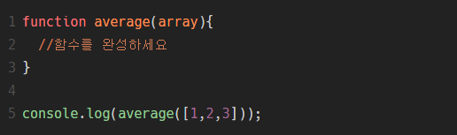

#평균구하기 by.helloworld 

###매개변수 array의 평균값을 return하도록 함수를 만들어 보세요  array는 정수만을 저장하는 배열입니다.


```js
function average(array){
  var array_len = array.length;
  var sum = 0;
  for(var i=0; i<array_len; i++){
    sum += array[i]
  }
  return sum / array_len ;
}

console.log(average([1,2,3]));
```
              

---
```js
function average(array){
    var array_len = array.length;
    for(var i=0; i<array_len; i++){
        array[i]
    }
}
```
내가 혼자 풀 수 있었던 부분은 여기까지!  
그 다음은 구글링으로 참고하여 풀었다.  


```js
  for(var i=0; i<array_len; i++){
   var sum = sum + array[i];
  }
```
sum에 대한 변수를 for문 안에서 선언하였다.  
console.log(typeof(sum))을 했을 때, number가 출력되었다.  
하지만, console.log(sum)을 찍어보면 NaN 값이 출력되었다.  
아직 이유를 모르겠다.  
         


변수를 선언하는 위치에 대해 더 공부해야겠다.  